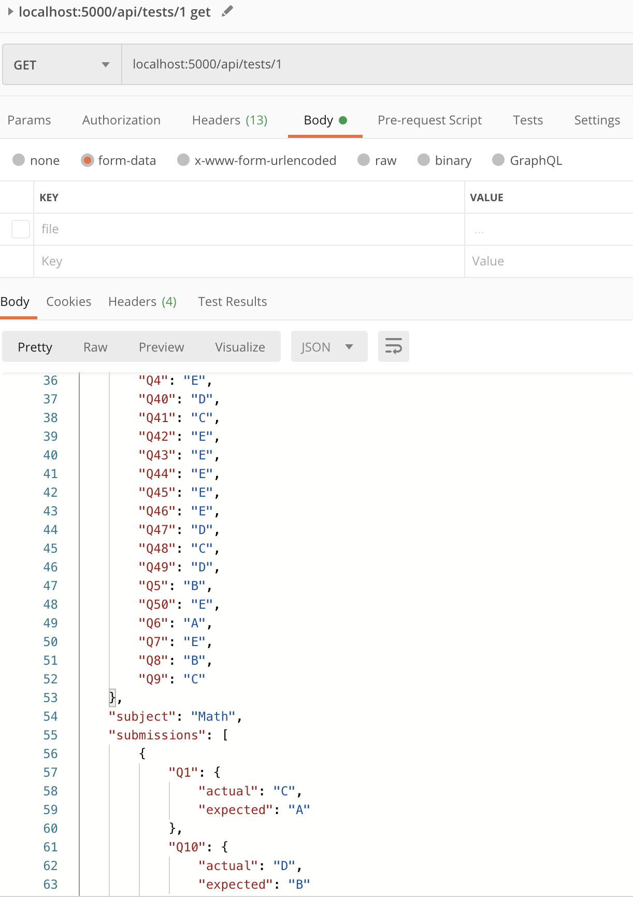

# cmpe273-assignment2
CMPE 273 Assignment 2

## Python Flask application

## Pre-requisites

```
cd bin
```

* Install _[Flask](https://palletsprojects.com/p/flask/)_

```
pipenv install flask==1.1.1
pipenv install marshmallow
```

* Run application
```
pipenv shell
% env FLASK_APP=app.py flask run
```

### REST Endpoints implemented.


* Post new test
```
POST http://localhost:5000/api/tests
```


* Post a submission file to a test_id
```
POST http://localhost:5000/api/tests/1/scantrons

curl -X POST -F file=@"/Users/thol/Downloads/cmpe273/cmpe273-assignment2/bin/scantron-1.json" http://localhost:5000/api/tests/1/scantrons
```



* Get submissions for a test
```
GET http://localhost:5000/api/tests/1
```

